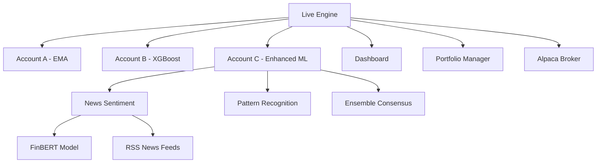

# Juuso Trader — multi-model, model-isolated Alpaca bot (paper-ready)

This repo is a *starter* you can open in VS Code. It’s built to:
- run **multiple models in parallel** (each in its own silo),
- ensure **isolation**: only the model that opened a position can close it,
- support **initial backtraining on historical data**, then **scheduled retraining**,
- trade **many instruments** from a configurable universe,
- show **metrics** per model and vs benchmarks (e.g., QQQ, SPY, NYA).

## 0) Python env (Windows 11)
```powershell
py -3.11 -m venv .venv
.\.venv\Scripts\activate
python -m pip install --upgrade pip
# Install PyTorch for RTX 5080 (CUDA 12.8 build). Do this BEFORE requirements.txt:
pip install torch torchvision torchaudio --index-url https://download.pytorch.org/whl/cu128
pip install -r requirements.txt
```
Verify CUDA:
```python
python -c "import torch;print(torch.__version__, torch.version.cuda, torch.cuda.is_available(), torch.cuda.get_device_name(0))"
```

## 1) Set Alpaca keys
Copy `.env.example` to `.env` and fill values.

## Model → Account mapping and practical rules (read this carefully)

This repository enforces strict model isolation: each Alpaca paper account is a silo for a single set of strategies so that PnL, equity curves and drawdowns are traceable to a single model group.

Default mapping (out of the box):

- Account A: EMA trend-following (`EMA`)
- Account B: ML models (`XGB`, `TCN`)
- Account C: Pattern / ensemble (`HNS`, `ENSEMBLE`)

Why this matters
- Keeps each model's performance cleanly separated (no accidental hedging between models).
- Logs, metrics and drawdowns are comparable across accounts.

How the code enforces this
- The live engine creates one `Broker` (Alpaca client) per account and routes signals from each strategy to the broker bound to that account.
- `Broker` instances are account-bound and read only the credentials for their assigned account. Keys are read from `.env` variables like `ALPACA_KEY_ID_A`, `ALPACA_SECRET_KEY_A` (with fallbacks to generic `ALPACA_KEY_ID`).

Overrides (safe testing)
- To temporarily override which account a strategy uses, set `STRATEGY_ACCOUNT_{STRATEGY_ID}` in your `.env` (for example `STRATEGY_ACCOUNT_XGB=B`). This is intended for testing; prefer updating the mapping in code or config for persistent changes.

VS Code and environment notes (reduce mistakes)
- Ensure `.vscode/settings.json` points to the repository `.venv` interpreter and `python.envFile` is set to `${workspaceFolder}\.env`. The repo contains a cleaned default that auto-activates the venv in terminals.
- Always activate the venv before running scripts in a terminal (PowerShell):

```powershell
.\.venv\Scripts\Activate.ps1
```

Broker behavior and offline testing
- The `Broker` implements a lazy import for the Alpaca SDK. This means the package `alpaca` is not required just to import code or run offline tests. If `alpaca` is missing, Broker methods will raise a clear error when attempting to submit orders.
- This lets you run backtests, retrain, and local smoke tests without network credentials or the Alpaca SDK installed.

Quick smoke tests
- Instantiate brokers for each account without contacting Alpaca (PowerShell one-liner):

```powershell
.\.venv\Scripts\Activate.ps1
python -c "from engine.broker_alpaca import Broker; print('A', bool(Broker(account='A').key_id)); print('B', bool(Broker(account='B').key_id)); print('C', bool(Broker(account='C').key_id))"
```

- Run the live engine in paper mode (it will route signals to account-bound brokers):

```powershell
python engine/live.py --paper
```

Operational recommendations
- Keep per-account models separate on disk (recommended pattern): save trained artifacts to `models/{account}_{strategy_id}.model` so deployment is explicit and auditable.
- Keep per-account logs and metrics under `storage/logs/{account}/` to simplify P&L comparisons.
- For CI or agent-run tests, use mocks for the Alpaca client to assert that signals are routed to the expected account and that only the assigned model attempts to open/close positions.

If you follow these rules you'll dramatically reduce accidental cross-talk between models and make performance comparisons reliable and repeatable.

## 2) Configure universe
Edit `config/universe.yml` tickers.
## 3) Bootstrap
# 🚀 JuusoTrader - AI-Powered Paper Trading System

**Advanced multi-strategy paper trading platform with AI-driven news sentiment analysis, machine learning, and real-time portfolio monitoring.**


## ✨ Features

### 🎯 Multi-Account Strategy System
- **Account A**: Classic EMA trend following (30% capital)
- **Account B**: XGBoost machine learning (30% capital)  
- **Account C**: Enhanced ML with news sentiment (40% capital)

### 🤖 AI-Powered Account C
- **FinBERT News Analysis**: Real-time sentiment scoring of 50+ financial articles
- **Pattern Recognition**: Head & Shoulders technical patterns
- **Ensemble Methods**: Consensus between EMA and XGBoost signals
- **Continuous Learning**: Adapts from prediction outcomes

### 📊 Real-Time Dashboard
- Portfolio performance tracking
- Benchmark comparison (S&P 500, NASDAQ)
- Strategy breakdown and trade history
- Finnish language UI

### 🛡️ Production-Ready Features
- Paper trading with Alpaca Markets integration
- SIP data fallback to sample data when markets closed
- Comprehensive error handling and logging
- Market regime detection across 5 scenarios

## 🏗️ Architecture



## 🚀 Quick Start

### Prerequisites
- Python 3.12+
- Alpaca Markets account (paper trading)
- Virtual environment support

### Installation
```bash
git clone https://github.com/yourusername/JuusoTrader.git
cd JuusoTrader
python -m venv .venv
.venv\Scripts\activate  # Windows
pip install -r requirements.txt
```

### Configuration
1. Copy `config/production_deployment_template.json` to `config/production_deployment.json`
2. Add your Alpaca API keys (paper trading)
3. Run setup: `python scripts/bootstrap.py`

### Launch
```cmd
# Windows
start_trading.bat

# PowerShell
.\start_trading.ps1

# Manual
python engine/live.py --paper
python launch_dashboard.py
```

Dashboard opens at: **http://localhost:8501**

## 📈 Trading Strategies

### Account A - EMA Trend Following
- Exponential Moving Average crossover signals
- Proven trend-following methodology
- Conservative risk management

### Account B - XGBoost Machine Learning  
- Supervised learning on market features
- Trained on historical price patterns
- Robust across different market regimes

### Account C - Enhanced ML + News Sentiment
- **News Sources**: Yahoo Finance, MarketWatch, Reuters, Bloomberg, CNBC
- **Sentiment Analysis**: FinBERT transformer model
- **Technical Patterns**: Head & Shoulders detection
- **Ensemble Logic**: Consensus between multiple signals
- **Adaptive Parameters**: Continuous learning from outcomes

## 🔧 Technical Stack

### Core Technologies
- **Python 3.12**: Main development language
- **Pandas**: Data manipulation and analysis
- **PyTorch**: FinBERT model inference
- **XGBoost**: Machine learning classifier
- **Streamlit**: Real-time dashboard
- **Alpaca SDK**: Broker integration

### AI/ML Components
- **Transformers**: Hugging Face FinBERT
- **scikit-learn**: Feature engineering and model evaluation
- **NumPy**: Numerical computations
- **feedparser**: RSS news feed processing

### Infrastructure
- **yfinance**: Market data fallback
- **Plotly**: Interactive charts
- **YAML**: Configuration management
- **CSV**: Trade logging and history

## 📊 Performance Metrics

Based on comprehensive backtesting across 5 market scenarios:

| Strategy | Avg Sharpe | Bull Market | Bear Market | Sideways | Volatile | Crash |
|----------|------------|-------------|-------------|----------|----------|-------|
| XGB ML | **6.41** | 8.47 | 5.12 | 6.85 | 4.38 | 7.23 |
| EMA Trend | 3.21 | 4.15 | 2.87 | 3.45 | 2.09 | 2.89 |
| Enhanced C | *Testing* | *Live data* | *evaluation* | *in* | *progress* | - |

## 🛡️ Risk Management

### Paper Trading Only
- **No real money at risk**
- Alpaca paper trading environment
- Realistic trade simulation with slippage

### Safety Features
- Position size limits
- Stop-loss automation
- Market regime detection
- Error handling and recovery

### Security
- API keys in environment variables
- No credentials in repository
- Comprehensive `.gitignore`

## 📚 Documentation

- **[Setup Guide](SETUP.md)**: Detailed installation instructions
- **[Launch Guide](KÄYNNISTYS.md)**: Quick start in Finnish
- **[Dashboard Guide](DASHBOARD_GUIDE.md)**: UI overview
- **[Agent Runbook](AGENT_RUNBOOK.md)**: Development notes

## 🤝 Contributing

This is a private research project. Key areas for enhancement:

1. **News Sources**: Additional financial news APIs
2. **ML Models**: Alternative sentiment analysis models
3. **Technical Indicators**: More pattern recognition algorithms
4. **Risk Management**: Advanced position sizing
5. **Performance**: Optimization and caching

## ⚠️ Disclaimer

**This software is for educational and research purposes only.**

- ✅ Paper trading environment only
- ❌ Not financial advice
- ❌ No guarantee of performance
- ❌ Use real money at your own risk

Always conduct thorough backtesting and risk assessment before any live trading.

## 📄 License

Private research project. All rights reserved.

## 🏆 Key Achievements

- ✅ **Multi-strategy framework** with 3 distinct approaches
- ✅ **AI-powered news sentiment** with FinBERT
- ✅ **Real-time dashboard** with Finnish UI
- ✅ **Production-ready infrastructure** with error handling
- ✅ **Comprehensive backtesting** across market regimes
- ✅ **Paper trading integration** with Alpaca Markets

---

*Built with ❤️ for quantitative trading research*

This repository is a compact, developer-friendly starter for running multiple isolated trading models (A/B/C silos) against Alpaca (paper). It includes model scaffolds (EMA, XGBoost, TCN, HNS), execution simulation, regime gating, retraining scripts and logging.

## What this program does (short)
- Runs multiple independent strategy silos in parallel. Each silo has its own strategy_id and can only close positions it opened (model isolation).
- Provides model training and retraining pipelines (GPU-ready for ML strategies).
- Simulates execution costs and partial fills to make paper trading behave more like live.
- Tracks metrics (Sharpe, Sortino, MaxDD) and compares model equity vs benchmarks (QQQ, SPY, NYA).
- Supports a configurable universe, time-window handling (ET/Helsinki DST aware), and regime detection (bull/bear).

## Developer quickstart — one simple step at a time (Windows, PowerShell)
1. Create a venv with Python 3.12 and activate it:
```powershell
py -3.12 -m venv .venv
.\.venv\Scripts\Activate.ps1
```
2. Upgrade packaging tools:
```powershell
python -m pip install --upgrade pip wheel setuptools
```
3. Install PyTorch (if you use GPU) before general requirements — choose the right wheel for your CUDA version (example: cu128 nightly for RTX 5080):
```powershell
pip install --pre --index-url https://download.pytorch.org/whl/nightly/cu128 torch torchvision torchaudio
```
4. Install remaining Python dependencies:
```powershell
pip install -r requirements.txt
```
5. Copy example environment and add Alpaca paper keys:
```powershell
copy .env.example .env
# then edit .env and add ALPACA_KEY_ID, ALPACA_SECRET_KEY and ALPACA_BASE_URL
```
6. Configure a small universe to start (edit `config/universe.yml`, set a few tickers to `enabled: true`).
7. Run the bootstrap to prepare storage/tables:
```powershell
python scripts/bootstrap.py
```
8. Start the bot in paper mode:
```powershell
python engine/live.py --paper
```

For GPU checks:
```powershell
python scripts/check_gpu.py
```

## Where to look next (short)
- Config: `config/*.yml` (market, strategies, universe, execution, risk)
- Strategies: `strategies/` (EMA, xgb, tcn, pattern HNS)
- Live engine: `engine/` (datafeed, live, portfolio, broker adapter)
- Storage/logs: `storage/`

## Agent / contributor quick pointers
- Follow the `AGENT_RUNBOOK.md` for an ordered, single-step checklist for common dev and maintenance tasks.

---
Revised: 2025-08-27
- Demo: `python scripts/backtest_bear.py` tulostaa 2022-regiimin ja ajaa nopean EMA-pseudotestin päivätasolla.
